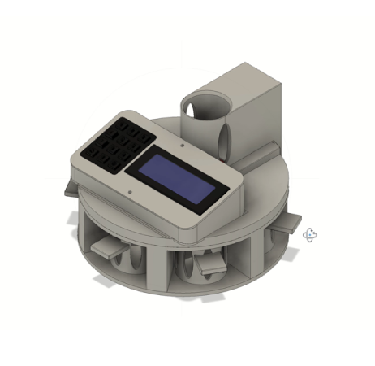
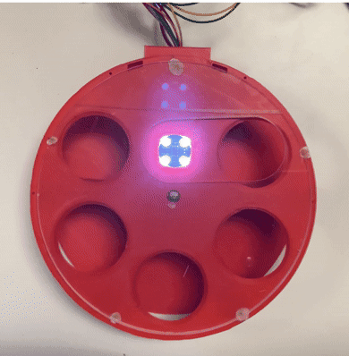
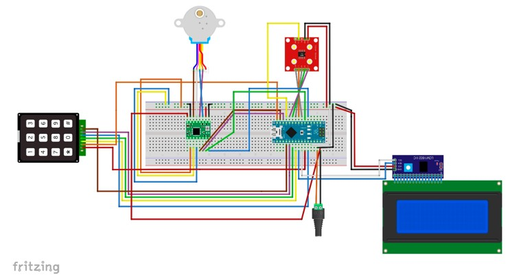
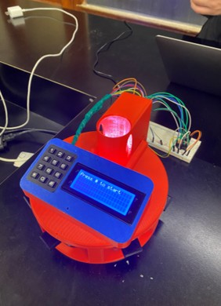

# PokerPal

PokerPal is an automated poker chip sorting system developed as part of Acadia University's Engineering Design II project.

The system uses a color sensor to identify poker chips and automatically sorts them into their corresponding bins using a servo-driven mechanism.

  

## How it Works

PokerPal follows a simple automated sorting process:

1. A stack of chips are entered into the systems hopper.
2. A poker chip enters the sorting mechanism.
3. A TCS3200 color sensor measures the chip's RGB color values.
4. The microcontroller classifies the chip based on experimentally determined color thresholds.
5. A stepper motor rotates the sorting mechanism to the corresponding bin.
6. The chip is directed into the appropriate bin.
7. The mechanism returns to its home position and waits for the next chip.

The system also tracks the number and total value of chips in each bin and displays this information on an LCD.

### Sorting Mechanism

  

## Features
- Automatic chip color detection
- Stepper motor-based chip sorting
- TCS3200 RGB color sensor
- Keypad interface for chip value input
- 20x4 LCD for system feedback
- Automatic chip counting and value tracking
- Bin capacity monitoring
- Embedded state-machine control
- Custom CAD-design
  
## Hardware
- Arduino microcontroller
- TCS3200 color sensor
- Stepper motor
- A4988 stepper motor driver
- 4x3 keypad
- 20x4 I2C LCD

### Electrical Schematic

  

## Software

The PokerPal control system was programmed in C++ using the Arduino framework.

The software is responsible for:

- Reading and classifying chip colors
- Controlling the stepper motor and sorting positions
- Managing the sorting state machine
- Handling keypad input
- Updating the LCD display
- Tracking chip counts and values
- Monitoring bin capacity

## Source Code

The complete source code is available in src/PokerPal.ino.

### Finished Product

  

  
## My Contributions

- Developed the embedded control system for automated chip detection and sorting.
- Implementing color classification using a TCS3200 color sensor and experimentally determined RGB thresholds.
- Developed motor control and a state-machine architecture to coordinate movement between sorting positions and the home position.
- Integrated the keypad and LCD to provide user input, system feedback, chip value tracking, and bin management.
- Co-designed the CAD model and mechanical integration of the sorting mechanism.
- Integrated the electrical and mechanical subsystems into the final automated sorting system. 
